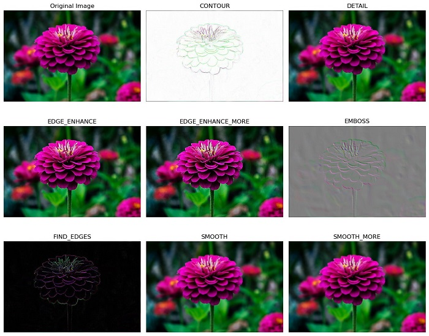

# 4. Naloga: Nevronske mreže in inženiring podatkov

Rok za zagovor: **19. december 2024, 23.55**

Število točk: **5** 

## Obvezen del (2,5 točke)
Z uporabo programskega jezika Python (Jupyter Notebook ali klasična Python datoteka) ter do sedaj uporabljenih knjižnic implementirajte osnovno obdelavo podatkov za podani podatkovni zbirki (zbirki iz naloge 1 in 2) ter vključite uporabo inženiringa podatkov ter značilnic. Zgradite napovedne modele z uporabo nevronske mreže in jih ovrednotite na enak način kot pri nalogi 3. 

Cilj naloge je naloge je uporabiti pridobljeno znanje iz področja inženiringa podatkov ter značilnic in se spoznati z gradnjo in uporabo napovednih modelov nevronskih mrež. 

### Obdelava podatkov
Postopka obdelave podatkov se lotite na podoben način kot ste se jih lotili pri prejšnjih nalogah s to razliko, da pri tej nalogi nadgradite proces z:
- Regresijski problem:
  - Manjkajoče vrednosti v podatkovni zbirki zapolnite z napovedanimi vrednostmi, pri čemer za napovedovanje vrednosti uporabite linearno regresijo.
  - Izvedite transformacijo vrednosti za sledeče značilnice, pri čemer uporabite primerne transformacije ([pomoč](https://www.davidzeleny.net/anadat-r/lib/exe/fetch.php/obrazky:pig_transformation.jpg)) glede na porazdelitev vrednosti posamezne numerične značilnice.
  - Zgradite tri nove smiselne značilnice.
  - Glede na porazdelitev vrednosti podatkov numeričnih značilnic po uporabi transformacij primerno uporabite proces normalizacije oz. standardizacije vrednosti.
  - Izvedite proces izbire značilnic s filtriranjem pri čemer uporabite metodo "information gain".
    - Glede na pridobljene vrednosti za posamezno značilnico sami presodite koliko izmed značilnic boste vključili v učenje.
- Klasifikacijski problem:
  - Normalizirajte polja slik. 

### Izgradnja napovednega modela
- Razdelite podatkovni zbirki z uporabo 5-kratne prečne validacije
- Ponovno naučite metode iz prvih treh nalog ter dodatno naučite algoritem nevronskih mrež (pri vseh metodah, kjer je mogoče nastavite parameter random_state na vrednost 1234)
  - Model nevronske mreže naučite z uporabo privzetih nastavitev.

### Ovrednotenje napovednega modela
- Ovrednotenje opravite na enak način kot pri nalogi 3.
- Primerjava napovednih modelov:
  - Shranite vse vrednosti vseh metrik za posamezen algoritem strojnega učenja (vse do sedaj uporavljene algoritme in različice nevronskih mrež.
  - Izračunajte povprečne vrednosti posamezne metrike za posamezen algoritem strojnega učenja glede na vrednosti v prečnih rezih.
  - Za vse metode (ansambelske in nevronske mreže), posebej za klasifikacijski problem in posebej za regresijski problem, izrišite grafikone kvartilov (angl. boxplot) za vsako izmed izračunanih metrik, pri čemer naj bodo v obeh primerih za vse algoritme strojnega učenja grafikoni kvartilov združeni na eni sliki (skupno torej 7 slik).
  - Izrišite stolpične diagrame za vse povprečne vrednosti posamezne metrike (posebej za klasifikacijski problem in posebej za regresijski problem) uporabljenih metod strojnega učenja. 

## Dodaten del (2,5 točke)
V dodatnem delu boste nadgradili procesiranje slikovne podatkovne zbirke ter zgradili dodaten lastno prilagojen model nevronske mreže.

### Obdelava podatkov
Postopek obdelave podatkov iz obveznega dela razširite:
- Regresijski problem:
    - Manjkajoče vrednosti v podatkovni zbirki zapolnite z napovedanimi vrednostmi, pri čemer za napovedovanje vrednosti namesto linearne regresije uporabite eno izmed ansambelskih metod.
    - Zgradite dodatni dve značilnici (poleg obstoječih treh iz obveznega dela).
- Klasifikacijski problem:
    - Pred pretvorbo slike v enodimenzionalno polje uporabite poljuben filter za zaznavo robov na sliki ([pomoč](https://pillow.readthedocs.io/en/stable/reference/ImageFilter.html)).
    - Izvedite normalizacijo slik.
    - Slike pretvorite v enodimenzionalno polje enako kot pri obveznem delu.

V ta namen uporabite poljuben filter iz nabora že implementiranih filtrov knjižnice knjižnice [pillow](https://pillow.readthedocs.io/en/stable/index.html), ki jih najdemo v modulu [ImageFilter](https://pillow.readthedocs.io/en/stable/reference/ImageFilter.html).

### Izgradnja napovednega modela
- Za klasifikacijski problem naučite ponovno naučite vse modele iz obveznega dela naloge.
- Za oba problema dodatno zgradite napovedni model nevronske mreže pri čemer poizkusite ročno nastaviti arhitekturo nevronske mreže ter vrednosti učnih parametrov na način, da dobite čim boljše rezultate.
  
### Ovrednotenje napovednega modela
- Novo naučene modela obvrednotite na popolnoma enak način kot pri obveznem delu naloge.
- Izvedite primerjavo rezultatov različnih algoritmov strojnega učenja glede na različno pripravo podatkov (brez predprocesiranja, po procesiranja in inženiringu značilnic).
- Prav tako primerjajte uspešnost nevronskih mrež s privzetimi nastavitvami in nevronskih mrež z vašimi nastavitvami.

## Zagovor naloge
Nalogo je potrebno zagovoriti na vajah pri asistentu.
