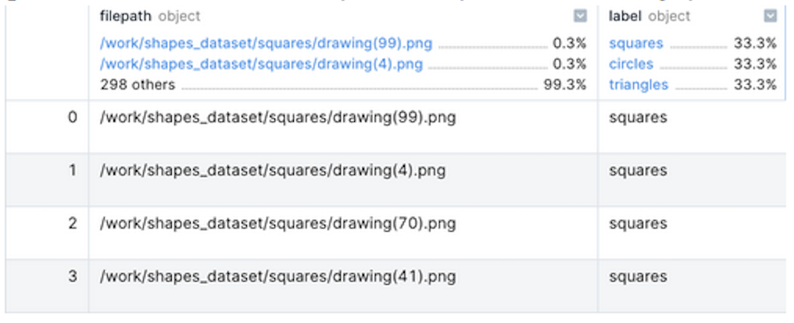
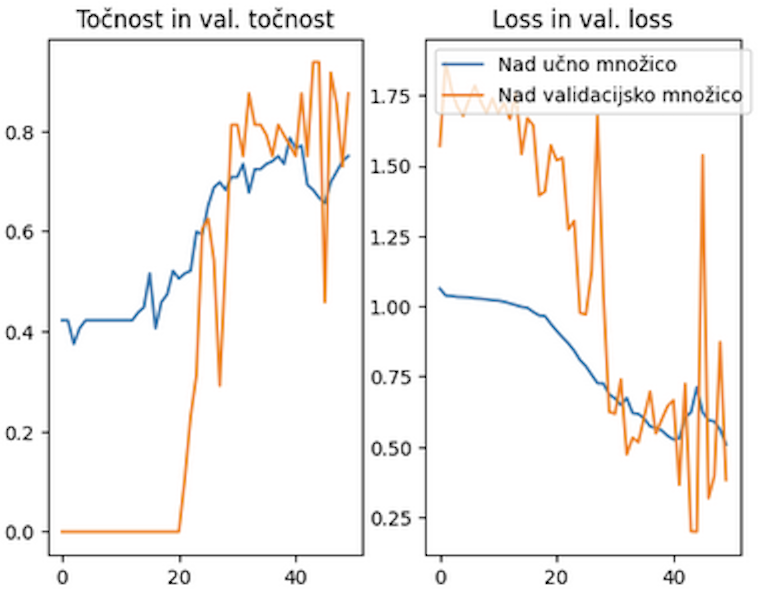

# 5. Naloga: Konvolucijske nevronske mreže

Rok za zagovor: **19. december 2024, 23.55**

Število točk: **5** 

## Obvezen del (2,5 točke)
Z uporabo programskega jezika Python (Jupyter Notebook ali klasična Python datoteka), do sedaj uporabljenih knjižnic in knjižnice Tensorflow (Keras) implementirajte osnovno obdelavo podatkov za podano podatkovno zbirko (zbirka iz naloge 2). Zgradite napovedne modele z uporabo konvolucijskih nevronske mrež in jih ovrednotite na enak način kot pri nalogi 3. 

Cilj naloge je naloge je uporaba konvolucijskih nevronskih mrež za reševanje problema razvrščanja slik in se spoznati z gradniki ter uporabo tovrstnih napovednih modelov nevronskih mrež.

### Obdelava podatkov
Postopka obdelave podatkov se lotite na podoben način kot ste se ga lotili pri nalogi 2 s to razliko, da pri tej nalogi proces prilagodite na način:

- Zgradite DataFrame z dvema stolpcema "filepath" in "label" kot je prikazano na sliki spodaj.
  
- Pripravite dva objekta DatalmageGenerator:
  - Za učno množico pri katerem nastavite parameter **rescale** za namen normalizacije slik ter parameter **validation_split** na vrednost **0.2**, ki služi za razdelitev učnih podatkov v razmerju 80:20, kjer je manjši del namenjen za ovrednotenje napredka učenja.
  - Za testno množico pri katerem nastavite parameter **rescale** za namen normalizacije slik 
- Znotraj zanke za 5-kratno prečno preverjanje z uporabo prej ustvarjenih objektov, ustvarite iteratorje slik za učno validacijsko in testno množico:
  - V ta namen uporabite metodo **flow_from_dataframe**, kateri poleg osnovnih parametrov potrebnih za pravilno delovanje, nastavite tudi parametre: batch_size=1, shuffle=True, seed=1234. 

### Izgradnja napovednega modela
- Razdelitev podatkovnih zbirk z uporabo 5-kratne prečne validacije.
- Gradnja modela (arhitekture) konvolucijske nevronske mreže:
  - Zgradite model konvolucijske nevronske mreže s sledečo arhitekturo:
    - Vhodni sloj, ki prejme vhodne podatke v obliki matrike velikost 28 x 28 x 1
    - 2-dimenzionalni konvolucijski sloj s 16 filtri in velikostjo kernela 3 x 3 ter aktivacijsko funkcijo relu
    - 2-dimenzionalni maksimizacijski združevalni sloj
    - 2-dimenzionalni konvolucijski sloj z 32 filtri in velikostjo kernela 3 x 3 ter aktivacijsko funkcijo relu
    - 2-dimenzionalni maksimizacijski združevalni sloj
    - 2-dimenzionalni globalni združevalni sloj s povprečenjem
    - Dva polno povezana oz. zgoščevalna sloja vsak s 128 nevroni in relu aktivacijsko funkcijo
    - Izhodni polno povezan oz. zgoščevalni sloj s tremi nevroni in aktivacijsko funckijo softmax
  - Zgradite napovedni model konvolucijske nevronske mreže z **lastno arhitekturo** s ciljem, da dobite čim boljše rezultate napovedne uspešnosti.
  - Učenje zgrajenih napovednih modelov konvolucijske nevronske mreže:
    - Napovedne modele učite največ 50 epoh.
    - Za optimizacijo učenja uporabite algoritem adam
    - Ostali parametri naj imajo nastavljene privzete vrednosti.
    - Naučena modela vrednotite na način opisan v spodnjem razdelku.
    - Zgodovino učenja vsakega modela v vsakem prečnem rezu shranite in jih po končanem učenje izrišite v obliki grafa.
    - Nastavitev hiperparametrov učenja:
      - Ponovno zgradite enaki arhitekturi konvolucijskih nevronskih mrež kot je zapisano zgoraj. Spremenite vrednosti hiperparametrov kot so velikost paketkov (batch), učna stopnja (angl. learning rate), optimizacijski algoritem, ipd. z namenom izboljšati in/ali pohitriti proces učenja. Zgolj parameter, ki definira število epoh naj ostane enak (50).
    - Na koncu ste torej zgradili in naučili 4 različne modele konvolucijske nevronske mreže.
      - Učne točnosti in validacijske točnosti ter vrednosti funkcije izgube (loss) tako nad učno kot nad validacijsko množico v vsakem prečnem rezu za en model izrišite na enem grafu. Spodaj je primer takšnega grafa za en model v enem prečnem rezu.
      

### Ovrednotenje napovednega modela
- Ovrednotenje opravite na enak način kot pri nalogi 3.
- Primerjava napovednih modelov: Shranite vse vrednosti vseh metrik za posamezen zgrajen model konvolucijske nevronske mreže Izračunajte povprečne vrednosti posamezne metrike za posamezen napovedni model konvolucijske nevronske mreže glede na vrednosti v prečnih rezih.
- Za vse metode zgrajene napovedne modele konvolucijskih nevronskih mrež izrišite grafikone kvartilov (angl. boxplot) za vsako izmed izračunanih metrik, pri čemer naj bodo v obeh primerih za vse algoritme strojnega učenja grafikoni kvartilov združeni na eni sliki (skupno torej 4 slike).
- Izrišite stolpične diagrame za vse povprečne vrednosti posamezne metrike zgrajenih napovednih modelov konvolucijskih nevronskih mrež ter rezultate primerjajte z dosedaj uporabljenimi algoritmi strojnega učenja.

## Dodaten del (2,5 točke)
Cilj v dodatnem delu je, da ustvarite čim boljšo arhitekturo konvolucijske nevronske mreže ter vrednosti parametrov z namenom doseči kar se da visoko napovedno uspešnost.

Uspešnost vašega modela boste preverili v okviru **Kaggle izziva** oz. tekmovanje v katerem se boste pomerili z vašimi sošolci (povezava bo deljena preko klasičnih komunikacijskih kanalov).  

Za namen tekmovanja lahko uporabite karkoli razen že vnaprej naučenih napovednih modelov ter priznanih arhitektur konvolucijskih nevronskih mrež. Poleg tega naj maksimalno število epoh ne presega 100.

Najboljši model si shranite v datoteko in ga uporabite za pridobitev napovedi nad testnimi podatki (ustvarite testni iterator nad slikami v mapi test). Na podlagi pridobljenih napovedi ustvarite datoteko za oddajo, ki jo oddate na Kaggle tekmovanje. Na Kaggle lahko dnevno oddate največ 100 datotek z rešitvami. Kaggle tekmovanje omogoča, da spremljate lestvico uspešnosti vseh sodelujočih. Poleg dosežkov vseh sodelujočih je tudi zapisana mejna vrednost uspešnosti napovednega modela (baseline), katero morate za dosego vseh točk pri dodatnem delu preseči.

Pri zagovoru boste ponovno pridobili napovedi za testne slike in ustvarili vašo datoteko za oddajo v namen preverbe, da datoteke za oddajo niste zapisali ročno, temveč je res rezultat napovedi naučenega modela.

## Zagovor naloge
Nalogo je potrebno zagovoriti na vajah pri asistentu.