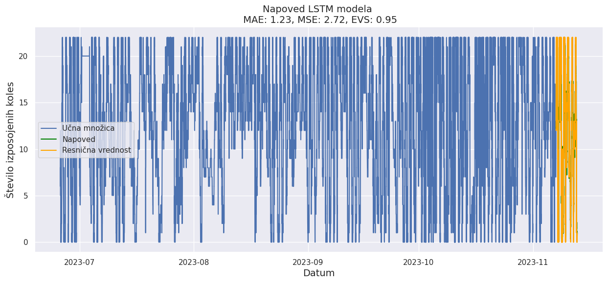
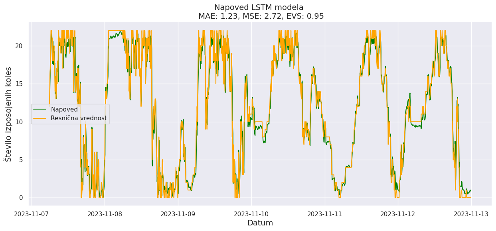
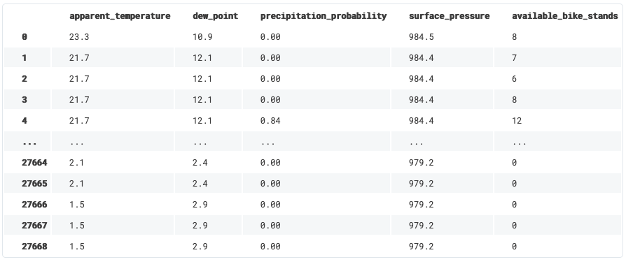

# 6. Naloga: Nevronske mreže s povratno zanko

Rok za zagovor: **19. december 2024, 23.55**

Število točk: **5** 

## Obvezen del (2,5 točke)
Z uporabo programskega jezika Python (Jupyter Notebook ali klasična Python datoteka), do sedaj uporabljenih knjižnic in knjižnice Tensorflow (Keras) implementirajte obdelavo podatkov za podano podatkovno zbirko. Zgradite napovedne modele z uporabo rekurentnih nevronskih mrež in jih ovrednotite z enakimi metrikami kot pri ostalih regresijskih nalogah.

Cilj naloge je naloge je uporaba različnih arhitektur in tipov rekurentnih nevronskih mrež za reševanje problema napovedovanja naslednje vrednosti v univariatnih in multivariatnih časovnih vrstah in se spoznati z gradniki ter uporabo tovrstnih napovednih modelov nevronskih mrež.

### Obdelava podatkov
Postopka obdelave podatkov se lotite na način, da iz podane podatkovne množice zgradite univariatno časovno vrsto izposoje koles. Postopek priprave podatkov naj zajema:
- Sortiranje zapisov glede na čas zapisa
- Izris grafa vrednosti izposoje koles glede na čas
- Iz celotnega DataFrama filtrirajte zgolj ciljno značilnico "available_bike_stands"
- Tako oblikovan DataFrame preoblikujte v numpy array za lažje nadaljnje delo
- Razdelite tako pridobljeno univariatno časovno vrsto na učno in testno:
    - Pri čemer za testiranje uporabite zadnje 1302 meritve
- Vrednosti časovne vrste preoblikujte (standardizacija/normalizacija) na pravilen način

### Priprava podatkov na učenje
- Podano časovno vrsto razdelite na okna velikosti 186
    - Pomikanje je s korakom enega zapisa
    - Primer: 
    
    

    - Pri tem vrednosti števila izposoje koles okna velikost 186 predstavljajo vhodne značilnice X, naslednja vrednost v vrsti pa y.
    - *Pomoč*:
        - Oblika učnih podatkov: X_train: (25995, 186), y_train: (25995,)
        - Oblika testnih podatkov: X_test: (1302, 186), y_test: (1302,)
    - Vhodne učne podatke preoblikujte v obliko (število primerkov, velikost koraka, število vrednosti).
    - *Pomoč*:
        - Preoblikovani X_train: (25995, 1, 186)
        - Preoblikovani X_test: (1302, 1, 186)

### Izgradnja napovednega modela
Izgradnjo treh arhitektur rekurentnih nevronskih mrež pri čemer naj:
- Ena arhitektura temelji na rekurentnih slojih nevronske mreže
    - Dva sloja RNN s 32 enotami
    - En polno povezan (dense) sloj s 16 nevroni
    - En izhodni polno povezan sloj z 1 nevronom
- Ena arhitektura temelji na GRU slojih nevronske mreže
    - Dva sloja GRU s 32 enotami
    - En polno povezan (dense) sloj s 16 nevroni
    - En izhodni polno povezan sloj z 1 nevronom
- Ena arhitektura temelji na LSTM slojih nevronske mreže
    - Dva sloja LSTM s 32 enotami
    - En polno povezan (dense) sloj s 16 nevroni
    - En izhodni polno povezan sloj z 1 nevronom
- Učenje zgrajenih napovednih modelov rekurentne nevronske mreže:
    - Napovedne modele učite poljubno število najmanj 10 in ne več kot 50 epoh.
    - Uporabite optimizacijski algoritem "adam" s privzetimi nastavitvami.
    - Zgodovino učenja vsakega modela shranite in jih po končanem učenje izrišite v obliki grafa (podobno kot pri prejšnji nalogi).

### Ovrednotenje napovednega modela
- Za vsak testni primerek napovejte naslednjo vrednost
- Nad učnimi, testnimi in napovedanimi podatki opravite inverzno operacijo standardizacije
- Za vsak model izračunajte metrike iz 1 naloge ter za vsak model izrišite grafa kot sta prikazana spodaj

## Dodaten del (1,5 točke)
Cilj v dodatnem delu je, da preizkusite delovanje rekurentnih arhitektur iz osnovnega dela nad multivariatnimi podatki.

### Obdelava podatkov naj zajema:
Postopka obdelave podatkov se lotite na enak način kot pri osnovnem delu s to razliko, da vključite poleg "available_bike_stands" tudi značilnice:
- apparent_temperature
- dew_point
- precipitation_probability
- surface_pressure

Primer takšnega podatkovnega okvirja je prikazan na spodnji sliki.

Morebitne manjkajoče vrednosti zapolnite z Random Forest regresorjem.

### Priprava podatkov na učenje
Korake enake kot pri osnovnem delu. Razlika je zgolj, da pri multivariatnih časovnih vrstah delimo v časovna okna več značilnic in ne zgolj ene.

*Pomoč:*
- Oblika učnih podatkov: X_train: (25995, 186, 5), y_train: (25995,)
- Oblika testnih podatkov: X_test: (1302, 186, 5), y_test: (1302,)
- Preoblikovani X_train: (25995, 5, 186)
- Preoblikovani X_test: (1302, 5, 186)

### Izgradnja, učenje in ovrednotenje napovednega modela
Izgradite in naučite modele enake kot pri osnovnem delu. Prav tako naj bo enako tudi ovrednotenje in izris grafov.

Dodatno primerjajte (z izrisom grafov) tudi pridobljene rezultate med modeli iz osnovnega in dodatnega dela.

## Zagovor naloge
Nalogo je potrebno zagovoriti na vajah pri asistentu.